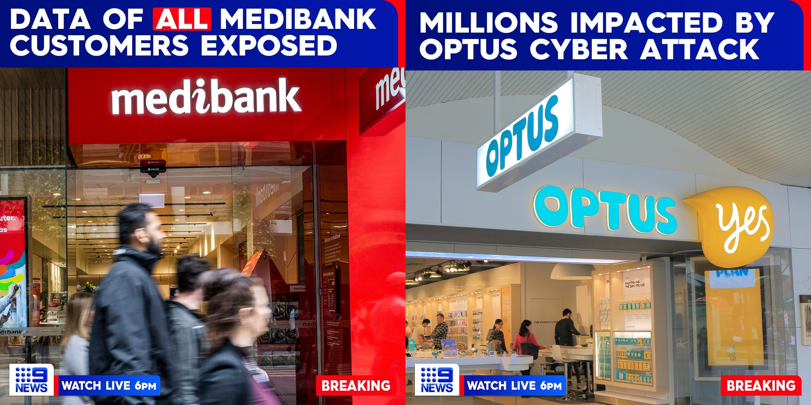
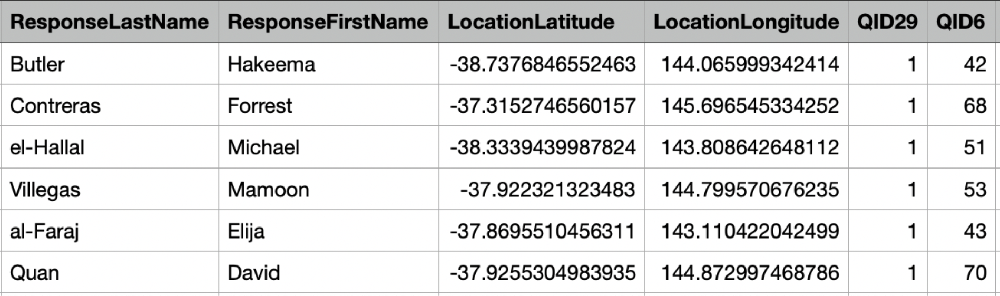

```{r setup, include=FALSE}
options(htmltools.dir.version = FALSE)
knitr::opts_chunk$set(
  fig.width=9, fig.height=3.5, fig.retina=3,
  out.width = "100%",
  cache = FALSE,
  echo = TRUE,
  message = FALSE, 
  warning = FALSE,
  hiline = TRUE
)
```

```{r xaringan-themer, include=FALSE, warning=FALSE, echo=FALSE}
library(xaringanthemer)
# install.packages("devtools")
# devtools::install_github("hadley/emo")
# xaringan::inf_mr()

style_duo_accent(
  primary_color = "#505680",
  secondary_color = "#63698b",
  inverse_header_color = "#d4c2b6"
)

xaringanExtra::use_panelset()

xaringanExtra::style_panelset_tabs(
  active_foreground = "#0051BA",
  hover_foreground = "#d22",
  font_family = "Roboto"
)

```


## Topics to be covered `r emo::ji("pen")`

.pull-left[
### `r emo::ji("small_orange_diamond")` About the Project

### `r emo::ji("small_orange_diamond")` Analysis 

### `r emo::ji("small_orange_diamond")` Walk through of App

### `r emo::ji("small_orange_diamond")` Conclusion

### `r emo::ji("small_orange_diamond")` Q&A
]

.pull-right[

.footnote[
Source: [Recent cyber attacks in Australia](https://www.instagram.com/p/Ciy8iJ5skO2/?utm_source=ig_web_copy_link)]
]

---
class: center, middle, inverse
# About the Project

---

# About the Project

.panelset[
.panel[.panel-name[Project Aim `r emo::ji("target")`]

`r emo::ji("professor")` About:
  - Dr. Pauline O'Shaughnessy (Professor at University of Wollongong),
  
  - Bradley Wakefield (PHd student, University of Wollongong)

  - .red[.bold[Measuring disclosure risk]] universally based on three key principles: .bold[distinctness, accuracy and undeniability].
  
  
  - Currently, they are working to make this framework more robust.
  
`r emo::ji("student")` This internship was about building an **R package** and a **shiny dashboard** for this disclosure risk assessment framework.


]
.panel[.panel-name[Micro-Data `r emo::ji("zoom")`]  

.pull-left[

Micro-Data or unit record data is data about individuals. This data contains records of personal information such as name, address, gender, identity numbers etc. 

.pull-left[

####  Personal Data

* Name
* Email Ids
* Identity Numbers
* Phone Numbers
* Bank Accounts
* Other Info


]
.pull-right[

####  Recorded

* Surveys
* Customer databases
* Administrative purposes
* Government records
* Health data 
* Research
]


.pull-right[


     
]

]


]

.panel[.panel-name[Associated Disclosure Risk  `r emo::ji("watch")`]

.pull-left[
* Informed consent: Whether participating individuals are aware of how their data will be used

* Legal Obligations: Australian Privacy Act 1988

* Moral and Ethical Responsibilities
]

.pull-right[
Examples:

* Informed consent: part of the data held may contain illegal material such as violation of copyright, intellectual property, identity theft and invasion of privacy.

* Legal Obligations: 
    - 'WZ' and CEO of Services Australia (Privacy) [2021] AICmr 12 (13 April 2021)
    - Optus Data Breach 

* Moral and Ethical Responsibilities: data publications that reveal private information of people that can cause personal harm both physical and mental.
]


]
]


---
# Disclosure Definition `r emo::ji("floppy_disk")` 

.panelset.sideways[

.panel[.panel-name[Dalenius (1977)]  

*“If the release of the statistics S makes it possible to determine the value [of some characteristic] more accurately than is possible without access to S, a disclosure has taken place. — Dalenius (1977)”*

This leads onto the discussion onto what characteristics in the data are important. Ofcourse, considering all characteristics of the data gives absolutely no information about the underlying population. 

]

.panel[.panel-name[Dwork (2006)]  

Differential Privacy notion of disclosure :
* Auxillary Information Risk: 
    Access to a database should not allow anyone to identify an individual whose information cannot be known without this database.
    *Example: Assume that the database yields the average salaries of women from different nationalities. A person who has access to this database and the auxiliary information that “S Jones earns $4000 more than the average Australian woman” learns S Jones’ salary, while anyone knowing only the auxiliary information, without access to the average salaries, learns relatively little.*


* *an auxiliary information generator with information about someone not even in the database can cause a privacy breach to this person. In order to sidestep this issue we change from absolute guarantees about disclosures to relative ones: any given disclosure will be, within a small multiplicative factor, just as likely whether or not the individual participates in the database. As a consequence, there is a nominally increased risk to the individual in participating, and only nominal gain to be had by concealing or misrepresenting one’s data. — Dwork (2006)*

]

.panel[.panel-name[maximum-knowledge-intruder perspective]  

* Disclosure scenarios when any aspect of the original data could already be public knowledge, known as the maximum-knowledge-intruder perspective Ruiz et al. (2018). 

* It is important to note that in this situation, we are merely intending to ensure that any existing knowledge can not be leveraged to obtain a greater understanding of confidential information.


]
]

---
class: center, middle, inverse
# Statistical Disclosure Control
Controlling disclosure rather than complete avoidance.


---

# Statistical Disclosure Control Methods `r emo::ji("control")` 

.bold[A trade-off exists between the .green[statistical utility] of the data and the .red[disclosure risk] associated. ]
  - Example: if we group all records in one group, then there is no meaning to clustering.
  


These types of methods include: 
* .bold[the addition of random noise] (Fuller, 1993; Shlomo, 2010)

* .bold[micro-aggregation] (Domingo-Ferrer and Mateo-Sanz (2002))

* .bold[rounding, rank and record swapping] (Nin et al., 2008; Dalenius and Reiss, 1982)

* .bold[data shuffling] (Muralidhar and Sarathy, 2006; Burridge, 2003) 

* .bold[Multiple Imputation with Multimodal Perturbation] (Melville and McQuaid (2012))


---
class: center, middle, inverse
# Disclosure Framework
(distinctness, accuracy and undeniability)


---

# Disclosure Framework `r emo::ji("computer")` 

In this work, the disclosure risk assessment formulated by Bradley Wakefield can be used for measuring disclosure risk universally based on three key principles: .bold[distinctness, accuracy and undeniability]. 

.panelset.sideways[
.panel[.panel-name[Scope]  
.content-box-neutral[Using these principles, we can obtain a disclosure risk measure associated with the release of protected data, 
- irrespective of what mechanism was used to protect it. 
- despite a difference in dimensionality between the original and protected data-sets.
- without assuming any particular joint probability structure between the original and protected data.

.content-box-duke-green[.blue[.bold[Assumption:]] we note that when referring to micro-data, we assume there is 
.bold[ at least one continuous variable in the data-set].]]

]
.panel[.panel-name[Disclosure Definition]  

```{r echo=FALSE}
knitr::include_graphics(here::here("analysis/figure/def1.png"))
```


]
.panel[.panel-name[Ellaboration]  
Disclosure, in .bold[ Definition 1]., is defined in terms of three key principles: distinctness, accuracy and undeniability. More simply put in order to have a disclosure 

(1) we need the observation value to be a sensitive characteristic (something likely pertaining to the individual only) within our original data-set (.bold[distinct]), 

(2) we need to be able to properly estimate this observation based on the release of information (.bold[accurately estimated]) and,

(3) we need our estimate to be able to be attributed with this observation with some level of certainty (.bold[undeniable]). 


]
]

---
# Determining if an observation is disclosed.
.pull-left[.content-box-yellow[.bold.Large[Plausible Deniability]: 

The greater the density of observations within a particular region of our sample 
space, the harder it is we can use this estimate to distinguish this observation from other observations in the space.]]

.pull-right[
```{r echo=FALSE}
library(patchwork)
library(tidyverse)
wage4 <- read.csv(here::here("data/wage4.csv"))
wage4_protected <- read.csv(here::here("data/wage4_protected.csv"))
a <- wage4 %>% ggplot() + geom_histogram(aes(wage)) + labs(title="Histogram of Mid−Atlantic Wage Data",x="Wage",y="Frequency") + theme_bw()  
b <- wage4_protected %>% ggplot() + geom_histogram(aes(wage)) + labs(title="Histogram of Protected Mid−Atlantic Wage Data",x="Wage",y="Frequency") + theme_bw()

a
b
```
]

---
# Framework functions: .red[drscore] and .red[update]
##Input Parameters
.pull-left[

```{r eval=FALSE}
drscore <-
  function(
    Sample, 
    Protected,
    delta = 0.05,
    neighbourhood = 1,
    kdistinct = 5,
    ldeniable = kdistinct,
    neigh_type = 'constant',
    numeric.vars = NULL,
    outlier.par = list(centre = median,
                       scale = var,
                       thresh = 0.01)
  )
```

]

.pull-right[

```{r eval=FALSE}
update <-
  function(DRisk,...)
```

.footnote[
Find detailed description of parameters in [**dress**](https://mohammedfaizan0014.github.io/dress/reference/index.html)]
]
]

---
class: center, middle, inverse
# Disclosure Scores
(Linkcounts, Linkscores, Linkscore_Levels)

---
# Disclosure Scores 
.panelset[
.panel[.panel-name[drscore]

* The primary results from drscore are given as .bold[Linkcounts] and .bold[Linkscore].

* Linkcounts has all the key combinations of categorical variables and numeral differences between the two data sets and potential matches such as outliers.

* Linkscore is the overall disclosure risk and other proportions that we’d like to estimate — distinct, accurately estimated and undeniable.

* Two widely used distances used in this package are Mahalanobis Distance and Euclidean Distance. 
]
.panel[.panel-name[update]
* Update mainly avoids re-calculation of the distances to save computation time. 

* It takes previous parameters from the DRisk object of the drscore. 

* Distances are re-calculated only when the neighborhood is different. 
]
]

---

class: center, middle, inverse
# Sample Output

---
### Linkcounts and Linkscores
.scrollable[
```{r exampleCont, message=FALSE, warning=FALSE, echo=FALSE}

library(svMisc)
#library(dress)
library(sdcMicro)

source(here::here("analysis/DisclosureRisk.R"))
source(here::here("analysis/DRisk_update.R"))

# ##################
# ##all continuous###################
CASC_sample <- CASCrefmicrodata[,c(2,3,4,6)]
CASC_protected <- addNoise(CASC_sample,noise = 100)$xm #Additive Noise protected

DRisk_NN <- drscore(
  Sample = CASC_sample, #Original Sample
  Protected = CASC_protected,
  delta = 0.05,
  kdistinct = 0.05, #k distinct threshold if integer then
                 # probability threshold is k/SS (SS = sample size)
  ldeniable = 5, # l undeniable threshold if integer then
                         # probability threshold is l/SS (SS = sample size)
  neighbourhood = 1,
  #Possible 'neighbourhood' types
  # 1 = Mahalanobis (Based on Mahalanobis Distance)
  # 2 = DSTAR   (Based on Density Based Distance)
  # 3 = StdEuclid (Based on Standardised (by std dev) Euclidean Distance)
  # 4 = RelEuclid (Relative Euclidean Distance sum_k ((Xk-Yk)/Xk)^2)
  neigh_type = 'prob',
  #Possible 'neigh_type' types
  #constant = fixed threshold on distance
  #prob = Nearest Neighbour Probability Neighbourhood used (Worst Case Scenario 1)
  #estprob = = Nearest Neighbour Probability Neighbourhood used based on protected density (Worst Case Scenario 2)
  numeric.vars = 1:4, #Which Variables are continuous?
  outlier.par = list(centre = median,
                     scale = var,
                     thresh = 0.01)
  #Parameters to adjust how MV outliers are determined.
  #Default is that lie 99% (based on Chi-Square n-1 dist) away from median after scale by variance.
)


```
]

---
### LinkScore_Levels

#### Continuous Data
```{r echo=FALSE}
DRisk_NN$LinkScore_Levels
```

#### Mixed Dataset

```{r examplemixed, message=FALSE, warning=FALSE, echo=FALSE, include=FALSE}

########################
## mixed dataset
########################
nn <- drscore(Sample = wage4, Protected = wage4_protected, numeric.vars = c(1,4))
```

```{r echo=FALSE}
nn$LinkScore_Levels
```

---
class: center, middle, inverse
# Walkthrough of RShiny App

---
###.Large[Reactive Shiny]: Key Challegenges

- **update**: update was modified to to calculate distances only when the neighbourhood from DRisk object from drscore was different from the new neighbourhood input.

- **Handling Numeric Variable**: name,position,range


.pull-left[
*Illustration*: 
```{r echo=FALSE}
head(wage4,4)
```

.content-box-neutral[Robust to:
- variables names not in the data-set
- out of bound subscripts
- non-numeric]

]

.pull-right[
```{r fig.cap="Handling Numeric Variables", echo=FALSE}
knitr::include_graphics(here::here("analysis/gif/nvar.png"))
knitr::include_graphics(here::here("analysis/gif/nvare.png"))
```
]

---
###.Large[Reactive Shiny]: 

.pull-left[- Incomplete Data
]

.pull-right[

```{r  echo=FALSE}
knitr::include_graphics(here::here("analysis/gif/data.gif"))
```
]

.pull-left[
- `update` button action before `drscore`
]

.pull-right[
```{r echo=FALSE}
knitr::include_graphics(here::here("analysis/gif/update.gif"))
```
]

---
# R Package: [dress](https://mohammedfaizan0014.github.io/dress/articles/dress.html)

>The package can be found on the [Github repository](https://github.com/mohammedfaizan0014/dress) and on its [webpage](https://mohammedfaizan0014.github.io/dress/index.html).

.pull-left[

`r emo::ji("pushpin")` roxygen2 documentation

`r emo::ji("pushpin")` Parameter Assertion Tests

`r emo::ji("pushpin")` vignette 

`r emo::ji("pushpin")` pkgdown website

`r emo::ji("pushpin")` R CMD Check and Github Actions

]

.pull-right[
```{r echo=FALSE, warning=FALSE, message=FALSE}
knitr::include_graphics(here::here("analysis/figure/pkg.png"))
```

]


---
# Work Done `r emo::ji("scroll")`

`r emo::ji("pushpin")` Developed 

--

`r emo::ji("pushpin")` Explored 

--

`r emo::ji("pushpin")` Improved our project management skills

--

`r emo::ji("pushpin")` Learnt to actively use GitHub in a more extensive manner

--

`r emo::ji("pushpin")` Refined our knowledge in processing of enormous datasets


---
class: center, inverse

.pull-top[
<br>
<br>
# Thank you
]

